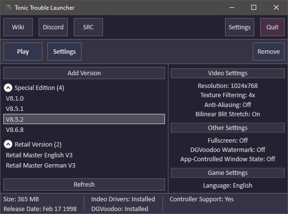
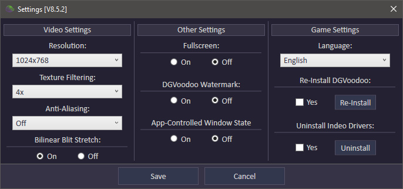
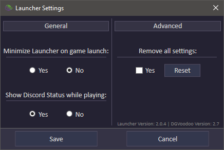

## Screenshots

# Description - [Latest Release](https://github.com/alweg/Tonic-Trouble-Launcher-MkII/releases)
A Launcher for **Tonic Trouble**

# Features
* Lets you easily install and start multiple versions of the game
* Supports **Retail Version** and **Special Edition**
* Support for *Discord Status*

## Libraries used
* [Memory.dll](https://github.com/erfg12/memory.dll)
* [Costura](https://github.com/Fody/Costura)
* [discord-rpc-csharp](https://github.com/Lachee/discord-rpc-csharp)
* [WindowsAPICodePack-Core](https://github.com/aybe/Windows-API-Code-Pack-1.1)
* [Newtonsoft.Json](https://github.com/JamesNK/Newtonsoft.Json)

## Other
* The Launcher comes with [dgVoodoo](http://dege.freeweb.hu/dgVoodoo2/ReadmeDirectX/) made by [dege-diosg](https://github.com/dege-diosg)/[diosg-dege](https://github.com/diosg-dege) which actually does all the magic. You can find more information on [VOGONS](https://www.vogons.org/viewforum.php?f=59/)
* You can find more useful tools for **Tonic Trouble** on my [Google Site](https://sites.google.com/view/tonictrouble)

## Releases
https://github.com/alweg/Tonic-Trouble-Launcher-MkII/releases
